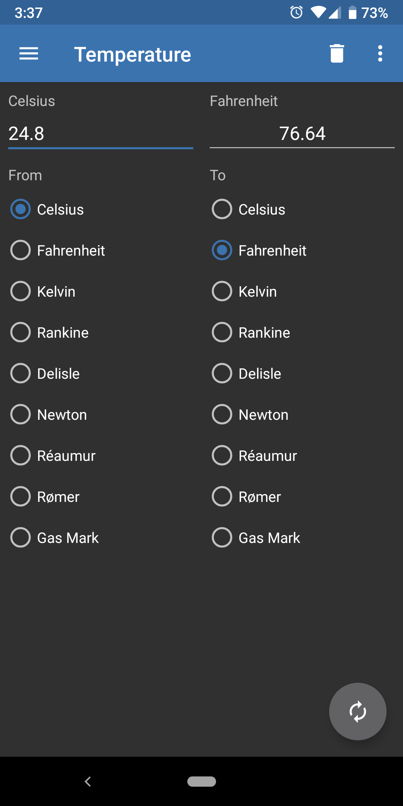

Unit Converter Ultimate
=======================

*A simple, lightweight, Material Design themed unit converter for Android.*

The beautiful Material Design user interface allows for quick and easy conversions from a number in one unit to another. The goal is to keep it simple - you won't be overwhelmed with an excess of options and settings, allowing you to perform your desired conversion as quickly as possible. Perfect for work, school or in the kitchen.

Available unit conversions include:
- Currency (US dollar, CDN dollar, pound, peso, etc)
- Temperature (celsius, fahrenheit, kelvin, etc)
- Length (kilometer, miles, meter, yard, feet, etc)
- Mass/Weight (kilogram, pound, ounce, ton, stone, etc)
- Speed (km/h, mph, knot, etc)
- Area (square kilometer, square mile, hectare, acre, etc)
- Cooking (teaspoon, tablespoon, cup, pint, quart, ounce, etc)
- Volume (cubic metres, cubic inches, litres, gallons, etc)
- Pressure (kilopascal, bar, PSI, etc)
- Power (watt, kilowatt, horsepower, etc)
- Energy (joule, calorie, BTU, etc)
- Time (year, month, day, hour, second, etc)
- Fuel Consumption (miles per gallon, liters per 100km, etc)
- Digital Storage (bit, byte, megabytes, gigabytes, etc)

Usage
------
- Use the slide-in menu for navigation between conversions and select the units you require. To open the slide-in menu, swipe in from the left edge of the app, or press the app icon in the top left corner.

- The converted value is fully customizable. Use the Settings menu to select the number of decimal places required as well as the grouping and decimal separators.

- Long-pressing on the converted value copies it to the clipboard.

- Pressing the swap Floating Action Button switches the selected units.

Building Yourself
-----------------
When building the project yourself, make sure to use the `base` build variant.  This will avoid using any of the Google services (such as Firebase or In-app billing) that contain my own private information.

Contributing
------------
Contributions are more than welcome and very appreciated!  Please create all Pull Requests against the 'develop' branch.  If you're interested in helping to translate the app into your language, please [e-mail me](mailto:physphil@gmail.com) or create a Pull Request!

Developed by
------------
Phil Shadlyn - physphil@gmail.com &nbsp;&nbsp;•&nbsp;&nbsp; [Install from Google Play](https://play.google.com/store/apps/details?id=com.physphil.android.unitconverterultimate)
